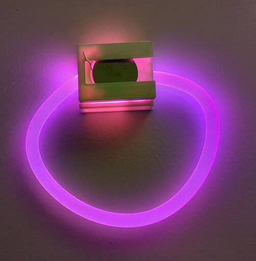
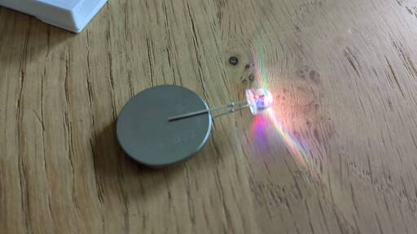
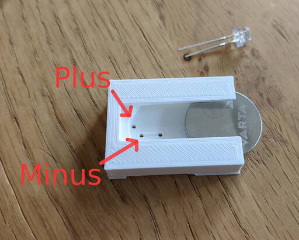
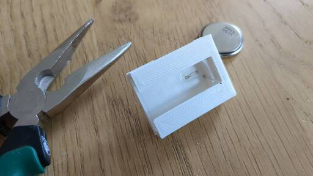
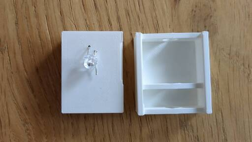
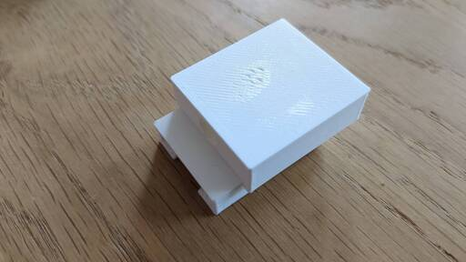
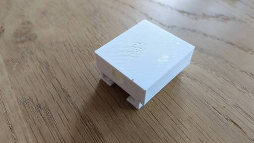

# Fiber Wristband

Arm- oder Halsband mit Glasfaser und RGB-LED für mehr Shininess :-)

Ein Bastelprojekt ohne Löten, mit klein(er)en Kindern durchführbar (kein Löten, Bastelzeit unter 10 Minuten).

## Material

* Knopfzelle CR2032
* Farbwechselnde RGB-LED "slow flashing" für ~ 3 V
* 3d-gedrucktes Gehäuse
* Glasfaser 6 mm (im Modell mit der Variable `fiber_diam` adaptierbar)

## 3d-Druck

Die Datei [fiber-wristband.scad](fiber-wristband.scad) kann mit [OpenSCAD](https://openscad.org/) geöffnet
und als STL gerendert werden. Um zwei einzelne STL-Dateien zu bekommen, entfernt man wechselweise
einen der beiden Aufrufe `battery_holder()` bzw. `lid()`.

Beide Teile lassen sich ohne Support drucken. 
Der Schnappmechanismus zum Halten der Batterie hat einen langen Overhang;
der Abstand kann mit der Variable `spacing` an den eigenen Drucker angepasst werden.

Selbiges gilt auch für die Führungsschiene für die Batterie: Die Batterie muss sich (trotz unvermeidbarem Sagging) noch durchschieben lassen; dies lässt sich mit der Variable `cell_thickness` angleichen.

## Intro (für Kinder)

Eine Knopfzelle hat den Pluspol an der Oberseite und am Rand und den Minuspol an der Unterseite.
LEDs funktionieren nur "in einer Richtung". Das kürzere Bein ist die Minus-Seite.
Klemmt man die LED richtig herum auf die Batterie, leuchtet die LED.

## Zusammenbau

Los geht's mit der Batterieseite.
Die Batterie kommt später in den Clip - zuerst muss die LED durch die Löcher gefädelt werden.

Denkt daran, die richtigen Beinchen in die richtigen Löcher zu fädeln, sonst funktioniert's hinterher nicht ;-)
Die LED muss möglichst weit durchgeschoben werden - aber nur so weit, dass später der Kopf noch umgebogen werden kann (siehe weiter unten).

Nun folgt der knifflige Teil: Das Bein vom Minuspol muss durch das verbleibende Loch zurückgefädelt werden:

Am einfachsten geht das mit einer spitzen Zange. Achtet darauf, dass der Draht möglichst flach in die
Vertiefung kommt. Hier muss nachher die Batterie drübergeschoben werden.

Nun wird die LED umgebogen, so dass sie später genau in die Glasfaser leuchtet:

Bleibt nur noch das Zusammensetzen mit der Halterung für die Glasfaser:

Die Batterieseite hat eine kleine Kerbe, in welche die Nut der Halterung passt.
Die Kerbe ist auf einer Seite zum Teil unterbrochen.
Setzt man (wie im ersten Bild) die beiden Teile leicht versetzt aufeinander,
kann man sie anschließend übereinander schieben.

Nun noch die Glasfaser auf die passende Länge zuschneiden und in die Löcher stecken - fertig!

## Inspiration

Ehre, dem Ehre gebührt: Zündfunken waren
[dieses Modell](https://cults3d.com/en/3d-model/home/led-light-torch) bezüglich "LED-Licht ohne Schalter"
und die Idee von [Geek Mom Projects](https://mastodon.social/@geekmomprojects/110705560695582386),
das mit einem Lichtwellenleiter zu erheiraten.
